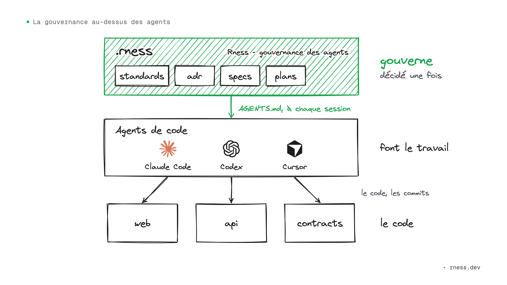
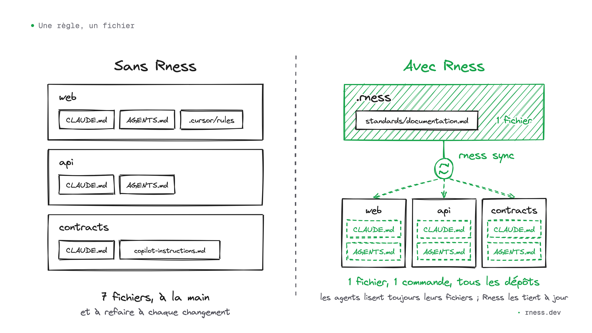
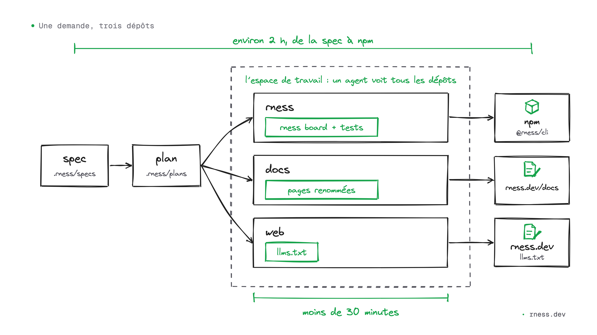

# Gouverner ses agents de code sur plusieurs dépôts, avec du Markdown et git

Je code avec des agents tous les jours : Claude Code la plupart du temps, Codex pour un second avis, Cursor ou Devin dans l'éditeur. Mon organisation GitHub compte plusieurs dépôts, dont un outil en ligne de commande, sa documentation et son site. Un agent peut savoir comment fonctionne un dépôt voisin, à condition que la configuration du dépôt où il travaille le lui dise. C'est de la configuration en plus dans chaque dépôt, et la garder synchronisée à la main devient vite lourd.

J'ai écrit Rness pour gouverner ces agents depuis un seul endroit. C'est un outil libre, sous licence MIT, qui ne fait tourner aucun modèle : il lit du Markdown et écrit du Markdown, dans vos dépôts. Voici comment il marche, ce qu'il fait déjà chez moi, et où il va.



## Un agent ne connaît que le fichier qu'il a sous les yeux

Claude Code lit `CLAUDE.md`. Codex, Cursor et GitHub Copilot lisent `AGENTS.md`. Ce qui est dans ce fichier, l'agent le sait à chaque session. Ce qui n'y est pas n'existe pas pour lui.

Dans une équipe qui code avec des agents, un dépôt a un `CLAUDE.md`, un `AGENTS.md` et un dossier `.cursor/rules`. Le deuxième a un `CLAUDE.md` recopié du premier il y a des mois, puis modifié. Le troisième n'a qu'un `.github/copilot-instructions.md`. La décision d'architecture prise le mois dernier dort dans un document qu'aucun agent n'ouvre. Chaque agent se fait sa propre idée de l'organisation, et plus les agents écrivent de code, plus ces idées divergentes finissent dans le code.

## Une règle, un fichier

Poser une règle pour tous les agents d'une organisation, c'est d'abord un compte de fichiers. Tenue à la main, une règle va dans au moins deux fichiers par dépôt, `CLAUDE.md` et `AGENTS.md`, et davantage dès que `.cursor/rules` ou les instructions de Copilot s'en mêlent. Trois dépôts, c'est six fichiers au minimum ; quarante dépôts, quatre-vingts. Quand la règle change, on recommence, et rien ne signale la copie oubliée.



Avec Rness, la règle s'écrit une fois, dans un standard du dépôt `.rness`. La commande `rness sync` réécrit à partir de lui un bloc généré dans le `AGENTS.md` de chaque dépôt, et chaque `CLAUDE.md` pointe déjà vers ce bloc. Voici le haut du bloc dans le dépôt de mon site :

```markdown
<!-- BEGIN rness -->
<!-- rness · scope: web · contract: 1 · hash: 69ac389a2b6b · generated: run `rness sync`, never edit inside this block -->
...
<!-- rness: standards/architecture.md -->
# Architecture and repository strategy
```

Chaque standard indique le fichier d'où il vient, pour savoir où le modifier. Chaque dépôt reçoit un petit commit, et `rness sync --check` fait échouer la CI d'un dépôt dont le bloc a pris du retard.

Un exemple récent : j'ai décidé qu'aucun texte que je publie ne porterait de tiret cadratin, parce que ce tiret est devenu la signature des textes générés. Il a suffi de trois lignes dans un fichier de `.rness` et d'une commande pour que tous les dépôts de mon espace de travail aient la règle, et que chaque nouvelle session d'agent démarre avec.

## Tout reste dans git

Le dépôt `.rness` est un dépôt git comme les autres. Les standards, les décisions d'architecture (ADR), les spécifications et les plans y sont des fichiers Markdown, avec un `rness.json` qui dit quelles règles s'appliquent à quel dépôt. Une règle change par un commit, relu comme du code.

Rness ne s'installe pas entre vous et vos agents. Il écrit dans les fichiers qu'ils lisent déjà, et dans `AGENTS.md` il ne touche qu'à son bloc, entre ses deux marqueurs : le reste du fichier vous appartient. Il n'envoie ni votre code ni votre contexte nulle part. La version de l'outil est épinglée dans `.rness`, la même pour toute l'équipe ; `rness upgrade` la déplace et fusionne avec git ce qu'elle change. Pour les clients MCP, `rness mcp` sert le même contexte, en lecture seule.

## Une demande, trois dépôts

L'intérêt se voit quand un changement déborde d'un dépôt. J'ai voulu renommer une commande de l'outil, `rness pulse`, en `rness board` : l'ancien nom désignait trois choses à la fois, et `rness pulse sync` côtoyait `rness sync` sans rien pour les distinguer.

Je l'ai demandé une fois, sous forme de spécification dans `.rness`, et l'agent en a tiré un plan. Il travaille depuis l'espace de travail, où l'outil, la documentation et le site sont côte à côte sous les mêmes règles : il voyait tout ce que le renommage touchait. En moins d'une demi-heure, il a commité la nouvelle commande et ses tests dans l'outil, puis les pages renommées de la documentation. Il a aussi mis à jour le `llms.txt` du site, le fichier que les autres agents IA lisent pour apprendre à se servir de l'outil. La nouvelle version était sur npm deux heures environ après la spécification.



## Une décision, vérifiée partout

L'outil exigeait Node 24. Un jour, une session de Claude Code dans un de mes projets, qui tourne sous Node 22, s'est ouverte sur une seule ligne : `rness needs Node 24 or newer (running v22.22.0)`. Le hook qui charge le contexte avait refusé de démarrer, Rness était éteint dans ce projet, et cette ligne était le seul signe.

Descendre à Node 22.17 tenait en quelques lignes de code, mais la décision touchait bien plus loin : la vérification de version, les `engines` de trois paquets, la matrice de CI, le README, la documentation, le site. Je l'ai consignée dans un ADR, avec un plan qui donnait une preuve à chaque changement. Quelques minutes après l'acceptation, l'outil, la documentation et le site avaient chacun leur commit.

Avant de clore le plan, la commande `/rness:plan check`, dans Claude Code, a rejoué toutes les preuves. Une recherche élargie a trouvé deux lignes oubliées au premier passage, toutes deux sur le site : le `llms.txt` annonçait toujours « Node 24 or later », et les données structurées aussi. Elles ont été corrigées le soir même, et le plan n'a été clos qu'ensuite.

## Ce qui vient ensuite

Ce que Rness fait aujourd'hui gouverne ce que les agents savent et ce qui a été décidé. La couche suivante gouvernera ce qu'ils ont le droit de faire : des politiques avec un périmètre, de l'organisation jusqu'à un dossier ou un motif de fichiers ; une vue de toute l'organisation qui montre quel dépôt s'est écarté des règles ; GitLab et Bitbucket à côté de GitHub. Tout cela est spécifié, rien n'est construit, et le site le marque « not shipped yet » jusqu'à ce que ce soit livré.

Sans organisation GitHub, `npm create rness mon-projet --blank` crée un espace de travail, et `rness add` y ajoute un dépôt par son URL git. Si vous travaillez sur une forge libre, Forgejo, Gitea ou une instance GitLab, dites-moi ce qui coince : c'est ce qui m'aidera à choisir la suite.

Rness est à la version 0.x : tant que c'est le cas, les commandes et le contrat de `rness.json` peuvent changer d'une version mineure à l'autre, et chaque version dit ce qui a changé.

## Essayer, contribuer

```bash
npm create rness
```

La commande demande votre organisation GitHub, ou crée un espace de travail sans organisation avec `--blank`. Ensuite, `rness sync` écrit les blocs et `rness status` montre où en est chaque décision, spécification et plan. Rness est lui-même construit avec Rness : ses règles, ses décisions et ses plans vivent dans son propre `.rness`.

Le code est sur [github.com/rness-dev/rness](https://github.com/rness-dev/rness), sous licence MIT. Les tickets marqués `good first issue` sont une bonne porte d'entrée, et les [Discussions](https://github.com/rness-dev/rness/discussions) accueillent les idées et les questions. La documentation complète est en anglais, à partir de la [prise en main](/guide/getting-started).

Et vous, qu'est-ce que votre organisation a décidé que vos agents ignorent encore ?
